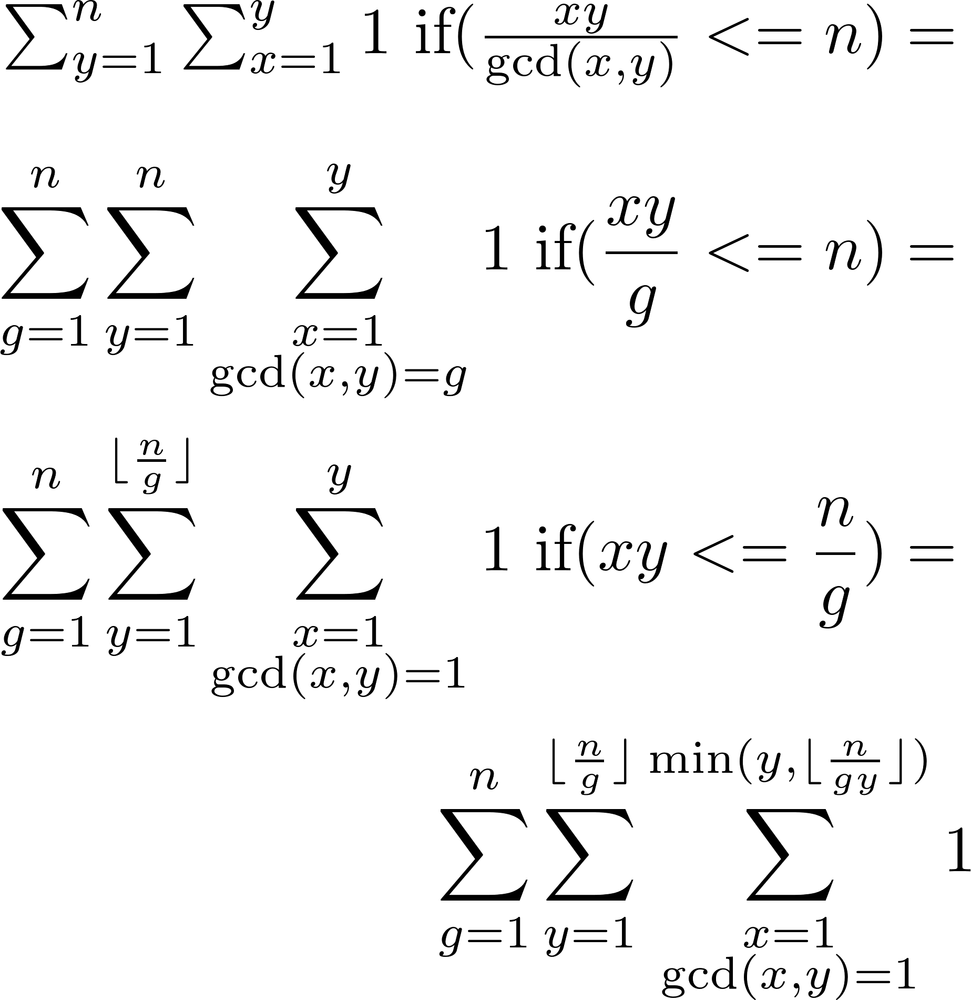
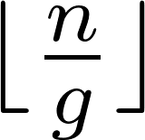
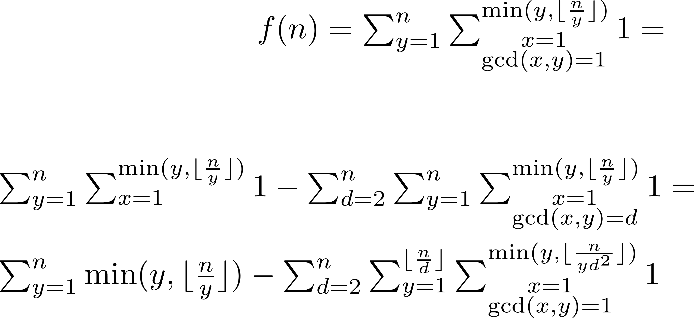
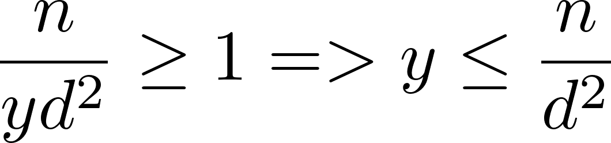
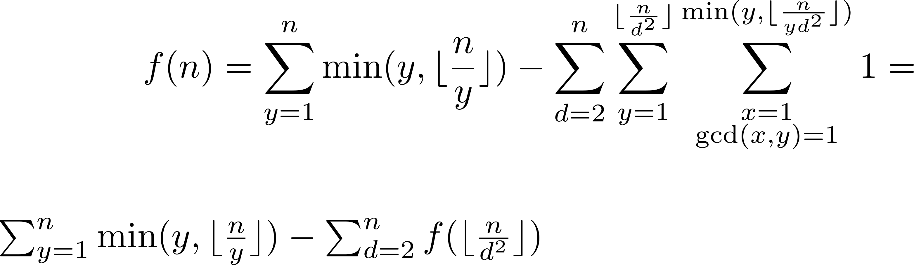

I think it's easier for me to write down the inclusion/exclusion principle first and then proceed with the problem.

Everything inside the first summation only depends on  so we can define the function f in the following way:

The inner most sum is zero unless . Thus,

The recursion is the core algorithm and the rest is just optimizing calculations of the summations when the term inside them ake the same value for a large number of indices.

---------------------------------------

### Sorry
I apologise for the horrible equation images as I had to manually convert them from LaTeX to PNG format, then manually insert them using HTML in Markdown. Since Markdown does not support JavaScript, I cannot use MathJax to parse equations beautifully.
